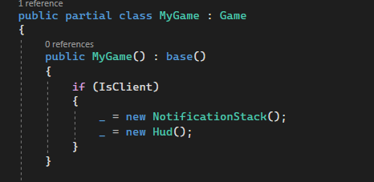
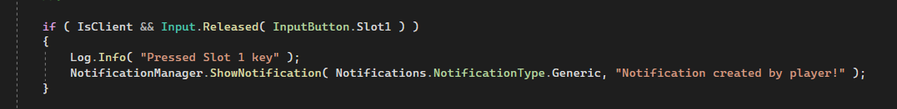
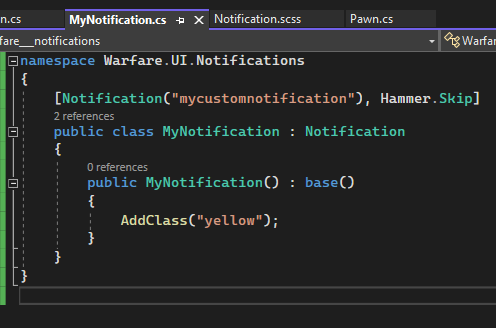
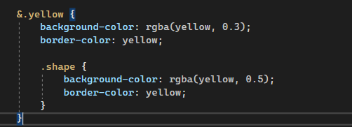
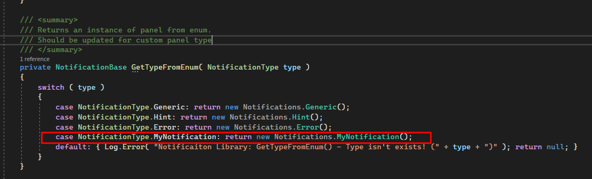

# <b>Notifications Library for S&amp;box Project Warfare</b>
## This is a library that allows you to call notification UI panels

 

## <b>How to add library to your addon?</b>
Clone this repository to folder you need via `git clone` command or add as submodule via [`git submodule`](https://git-scm.com/book/en/v2/Git-Tools-Submodules) command.

## <b>How to use it?</b>
This repository has a main part with library's source code and an example project, that you can use to understand how this library can be used. Keep in mind, in example project backend part stores in `code/notifications` and frontend in `ui/notifications`

To activate library you must:
* Initialize `NotificationStack` in game script's constructor to store data;

* Call `NotificationStack.Push` method from it in player's code (check "Notifications Library API") with data type you need;

* Have fun.

## <b>How to make a custom notification?</b>
If you want to make your own notification type with custom style, you need to do:
* Inherit your custom class from `Notification`;

* Open `styles/NotificationsStyle.scss` file and set style for your custom notification type. For example, since we wrote "yellow" in class, we should add `&.yellow` class style realization. If you have any problems, check styles code above.

* Now you can call `NotificationStack.Push` method with your new type.

## <b>We'll be glad if you send your feedback about library and what problems you've get to ["Issues"](https://github.com/sbox-MillitaryRP/sbox-mrp-notifications/issues) section</b>
