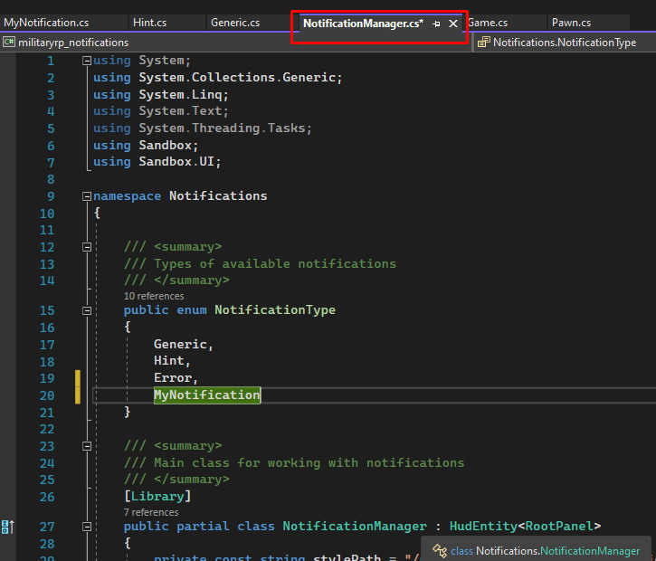

# <b>Notifications Library for s&amp;box MilitaryRP</b>
## This is a library that allows you to call notification panels for any reasons (you've get an error, or game must notify you about something), that basically developing for MilitaryRP project

## This library currently in <b>alpha</b> and not fully stable (check "Known issues")

## <b>How to add library to your addon?</b>
Clone this repository to folder you need via `git clone` command or add as submodule via [`git submodule`](https://git-scm.com/book/en/v2/Git-Tools-Submodules) command.

## <b>How to use it?</b>
This repository has a main part with library's source code and an example project, that you can use to understand how this library can be used.

To activate library you must:
* Initialize `NotificationManager` in script you need;

* Call `ShowNotification` method from it (check "Notifications Library API");

* Have fun.

## <b>How to make a custom notification?</b>
If you want to make your own notification type with custom style, you need to do:
* Inherit your custom class from `NotificationBase` and make changes if you need (and don't forget to add it to `Notifications` namespace);

* Add your new type in "`NotificationManager.cs` -> `NotificationType`" enum and in `GetTypeFromEnum()` method;

* Open `styles/NotificationsStyle.scss` file and set style you want. We recommend you to copy and paste our style example that you can modify it faster and more easier. Structure of panel style must be started from your class name and all class child fields (like title, message) must be inside it.

* Now you can call `ShowNotification` method with your new type.

## <b>Notifications Library API</b>
* `ShowNotification(NotificationType type, string text)` - calls a notification with required type and message.

Since this method uses `ClientRPC` feature from S&box, you can call the method with `To.Single()` parameter to a target player (check [sbox's wiki](https://wiki.facepunch.com/sbox/RPCs))

## <b>Known issues</b>
* A notification can be displayed outside the screen when at least one notification is removed from the visible area;
* The queue system hasn't been implemented yet to display the notification flow correctly.

## <b>We'll be glad if you send your feedback about library and what problems you've get to ["Issues"](https://github.com/sbox-MillitaryRP/sbox-mrp-notifications/issues) section</b>
